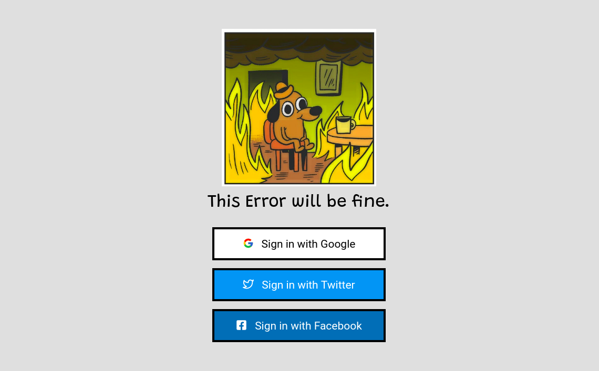
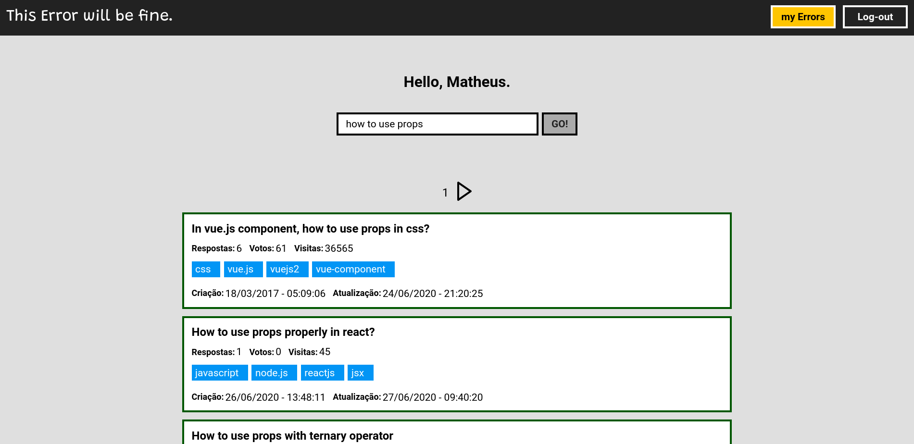
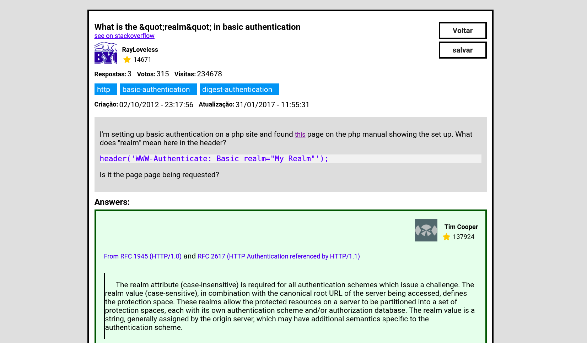

<h1 align="center">
  
</h1>

<h3 align="center">
  Desafio: IBM
</h3>

Aplicação de consulta de erros via API da StackOverflow.

## Sobre o desafio

A automatização da correção de erros é algo muito util para garantir a qualidade e estabilidade de aplicações. A estratégia de crowdsourcing ajuda muito nessa tarefa. O objetivo dessa aplicação é buscar possíveis soluções para um erro, cuja descrição/código o usuário irá digitar em um campo de busca.

## Tecnologias

Esse projeto foi desenvolvido com as seguintes tecnologias:

- [Node.js](https://nodejs.org/en/)
- [React](https://reactjs.org)

## Resultado:

**WEB:**

Tela de login da aplicação. É possível fazer a autenticação por meio do Google, Twitter e Facebook.

  

Tela inicial, onde o usuário poderá consultar os seus erros.

  

Um exemplo de resposta:

  

## Back-end

Para executar o back-end é preciso acessar, via terminal, a pasta `server` e executar o comando `yarn dev`

## Web
 
Para executar a aplicação web você deve acessar, via terminal, a pasta `web` e executar: `yarn start`.

